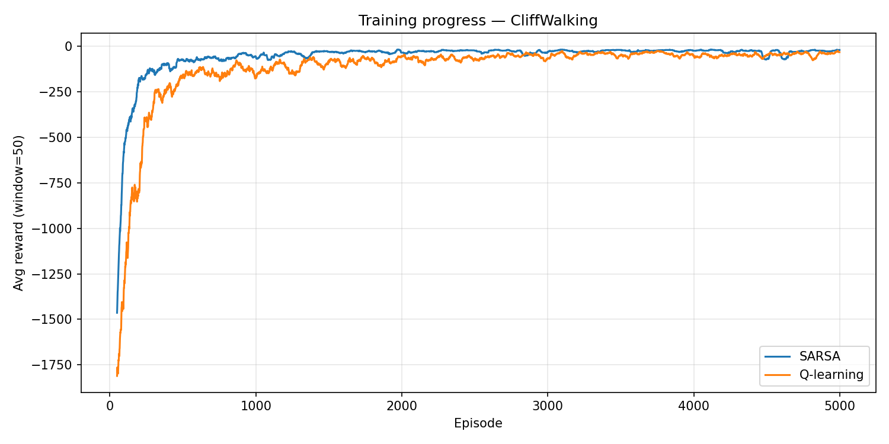
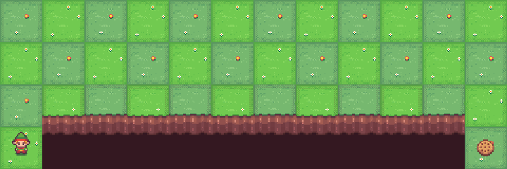

    # CliffWalking — SARSA vs Q-learning

    CliffWalking is a 4×12 grid with a cliff along the bottom edge.
    Each step costs −1; falling off the cliff costs −100 and resets to start.
    The goal is to reach the bottom-right corner in as few steps as possible.

    This is the classic environment from **Sutton & Barto Chapter 6** that
    highlights the on-policy vs off-policy distinction:

    | | SARSA (on-policy) | Q-learning (off-policy) |
    |---|---|---|
    | **Update target** | Q(s′, a′) — next action from ε-greedy | max Q(s′, ·) — greedy best |
    | **Learned path** | Safe path one row above cliff | Optimal cliff-edge path |
    | **Eval reward** | ~−17 (longer but safe) | ~−13 (shortest path) |
    | **Training noise** | Low (avoids cliff during exploration) | High (falls off cliff while ε > 0) |

    ## Training curves

    SARSA converges to a higher (safer) online reward during training because
    its on-policy update accounts for accidental cliff falls under ε-greedy.
    Q-learning has a noisier training curve but discovers the shorter path.

    

    ## Learned policies (one eval episode each)

    <table>
    <tr>
      <th>SARSA — safe path (~−17)</th>
      <th>Q-learning — cliff-edge path (~−13)</th>
    </tr>
    <tr>
      <td></td>
      <td></td>
    </tr>
    </table>

    ## Policy grids

    `S` = start, `G` = goal, `C` = cliff.
    Actions: `U` up · `R` right · `D` down · `L` left.

    **SARSA**
    ```
    +---+---+---+---+---+---+---+---+---+---+---+---+
| R | R | R | R | R | R | R | R | R | R | R | D |
+---+---+---+---+---+---+---+---+---+---+---+---+
| U | U | U | U | U | U | U | U | L | U | R | D |
+---+---+---+---+---+---+---+---+---+---+---+---+
| U | L | U | U | U | U | U | U | R | U | R | D |
+---+---+---+---+---+---+---+---+---+---+---+---+
| S | C | C | C | C | C | C | C | C | C | C | G |
+---+---+---+---+---+---+---+---+---+---+---+---+
    ```

    **Q-learning**
    ```
    +---+---+---+---+---+---+---+---+---+---+---+---+
| D | R | R | R | R | R | R | R | R | R | R | D |
+---+---+---+---+---+---+---+---+---+---+---+---+
| R | R | R | R | R | R | R | R | R | R | R | D |
+---+---+---+---+---+---+---+---+---+---+---+---+
| R | R | R | R | R | R | R | R | R | R | R | D |
+---+---+---+---+---+---+---+---+---+---+---+---+
| S | C | C | C | C | C | C | C | C | C | C | G |
+---+---+---+---+---+---+---+---+---+---+---+---+
    ```
